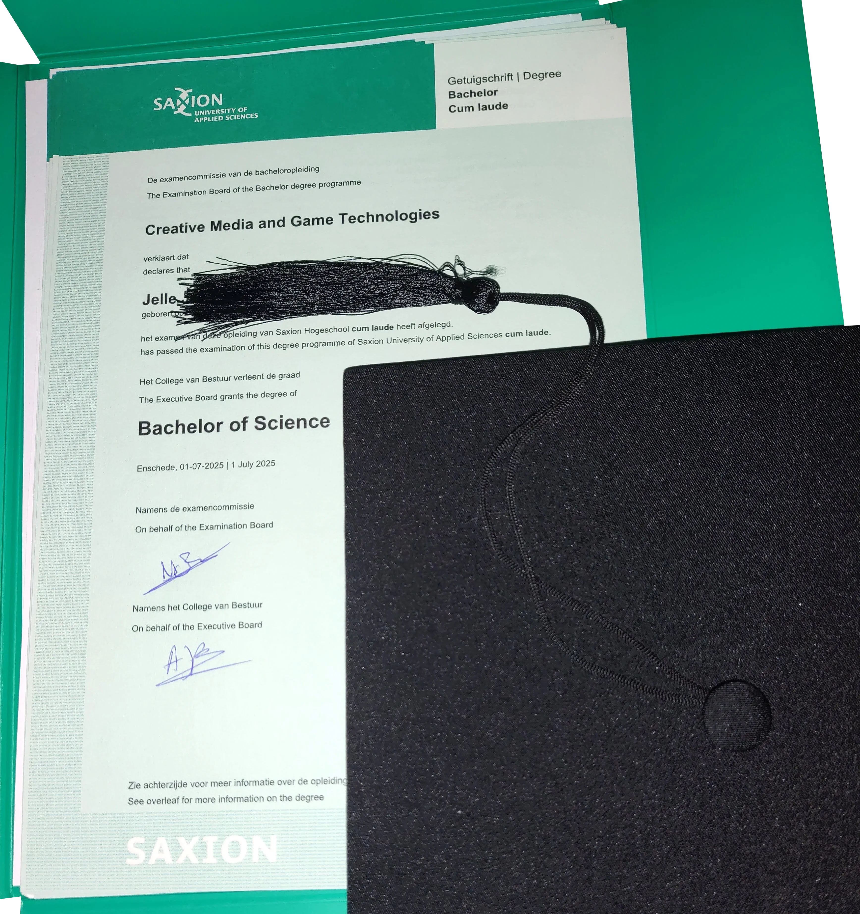

<!--- region: title -->
# Hi there! 👋
<!--- region: visual -->
|  | Programming's my art Empty files are my canvas And code is my brush |
|---|:---|

<!--- region: intro -->
My name is Jelle ([IPA](https://en.wikipedia.org/wiki/Help:IPA/Dutch): /ˈjɛ.lə/), and I like creating stuff!  
I am currently looking for a Game Graphics Programming job.  
In July 2025, I graduated [Cum Laude (With Honours)](https://en.wikipedia.org/wiki/Latin_honors#Netherlands)
the study _Creative Media and Game Technologies_ at _Saxion University of Applied Sciences_.

I love learning fun things and having fun learning things!

Click here to read about my full journey as a developer

My first start with programming was GameMaker 8.1 Lite when I was eight.
I started off only using the visual programming, and I never really got into GML.
Sadly, most of the games I made back then have been lost to time.

A year or two later I discovered Minecraft with its redstone, and I was sold.
When command blocks were added a little later, I was even more hooked.
I spent years playing with it, learning and getting better.
I also loved the big tech modpacks, though my computer back then couldn't really run them well.

When I was around eleven, my primary school installed Scratch on their computers.
Me being the curious type and seeing that a new icon had appeared on the desktop,
I clicked it and almost immediately recognized it as being a similar thing to GameMaker.
I quickly became quite good at it, though sadly most of those projects have also been lost.

Around thirteen, I tried my hand at making Android Apps with Android Studio, which was my first usage of a "real" IDE.
It was difficult to suddenly use such a huge, complicated program, but ultimately,
I did succeed in making an app that my parents still use to this day.
I enjoyed learning Java during the process of making these apps, though I probably should have learned Java first,
and only then started making apps with it.

Around 2017, I played a lot of the game Scrap Mechanic, and when they released the mod tool,
I was one of the first people to release a mod onto the Steam Workshop.
[My most popular mod](https://steamcommunity.com/sharedfiles/filedetails/?id=876955273) has been downloaded almost 50 000 times!

For the second half of secondary school, I had to buy a TI 84 CE-T calculator
and I almost immediately started making useful programs and fun games in TI-Basic.

Then I discovered The Coding Train on YouTube and I started using Processing a lot.
So for the next four or five years I used that for basically all of my programming.
I don't use it that much anymore these days, but I still really like it.

I have also made a few Minecraft plugins in Java, scripts in Python, websites with raw HTML and CSS,
and C++ and C programs, among many other things. I like to experiment with a lot of things and learn a lot.

During my first year at Saxion I have learnt C# with their GXP Engine, which I'm working on overhauling with a couple of fellow students.
I also learnt Unity, which I have since made a couple game (prototypes) with.

In the holiday after that first year, I worked a lot on a project that I felt needed to exist: GitDroid.
It's an Android app, made with Flutter, that allows you to easily install and update other Android apps from GitHub.
It's still in development, but it's already quite usable.

During my second year at Saxion, I officially learnt C++ (I'd been tinkering with it off and on for a couple of years prior)
and I'm also learning Unreal Engine. Learning Rust also seems like fun!

I've also been continuing my use of Flutter, and I've been making some other things with it as well, such as CMGTwitch.
During my usage of Flutter, I've naturally been using Dart, which I've grown to like quite a lot.

During my third year at Saxion, I had my first internship at a company that develops XR trainings for other businesses.
It was a lot of fun to work there, with such friendly and knowledgeable colleagues. I learnt a lot there.

In the first half of my fourth and last year at Saxion, I was a part of a ten-person team,
where we worked on an [Unreal Engine VR Experience](https://technicjelle.tumblr.com/tagged/Weaving%20Factory) together.
My role in the project was of Infrastructure Engineer, and as part of that, I set up Perforce Helix Core as Version Control System for us all to use.
In addition to that, I set up automated builds with Jenkins, to keep track of build-breaking bugs that might slip in.  
In that same time, I also worked as a Teacher's Assistant for Saxion, helping with the C++ and 3D Rendering courses.

In the second half, I did a Graduation Internship at [Rythe Interactive](https://github.com/Rythe-Interactive), as a Graphics Programmer.
I was tasked with creating prototypes for the new Low Level Rendering Interface for the next rewrite of the engine.
During this project, I solidified my knowledge of the basics of modern GPU Programming with Vulkan, but also SDL3's GPU API.
You can read the graduation thesis I wrote for this [here](https://github.com/TechnicJelle/CMGT_GraduationReport)!

In July 2025, I graduated [Cum Laude (With Honours)](https://en.wikipedia.org/wiki/Latin_honors#Netherlands)
the study _Creative Media and Game Technologies_ at _Saxion University of Applied Sciences_.

Not only do I really like making games, I also really enjoy making tools for people to make their lives easier in some way.
Some examples of things I made for other people are [WesleyChess](https://github.com/TechnicJelle/WesleyChess), [LifeWrench](https://github.com/TechnicJelle/LifeWrench),
[Hydr8](https://github.com/TechnicJelle/DiscordHydr8Bot), and [Simple Block Commands](https://github.com/TechnicJelle/SimpleBlockCommands).
Hardly a week goes by where I don't automate some part of my own or someone else's life.

My logo was made by myself with Blender.
Check out my other art on my [ArtStation](https://www.artstation.com/TechnicJelle).

<!--- region: connect -->
## Find me on other platforms

<!--- region: experiences -->
## Experiences

<!--- {{toc}} -->

<!--- region: projects -->
## 🎮 Games

## ⚙️ Game Engines

## 💡 Tech Demos

## 🖥️ Desktop Software Tools

## 📱 Apps

## 🌐 Websites

## 🔌 Server Software

## 📝 Scripts

## 🤖 Discord Bots

## 🎨 Skins

## 🌌 Simulations

## 📚 Libraries

## ⛏️ Minecraft Plugins

### 🌐 [BlueMap](https://github.com/BlueMap-Minecraft/BlueMap#readme) Addons

