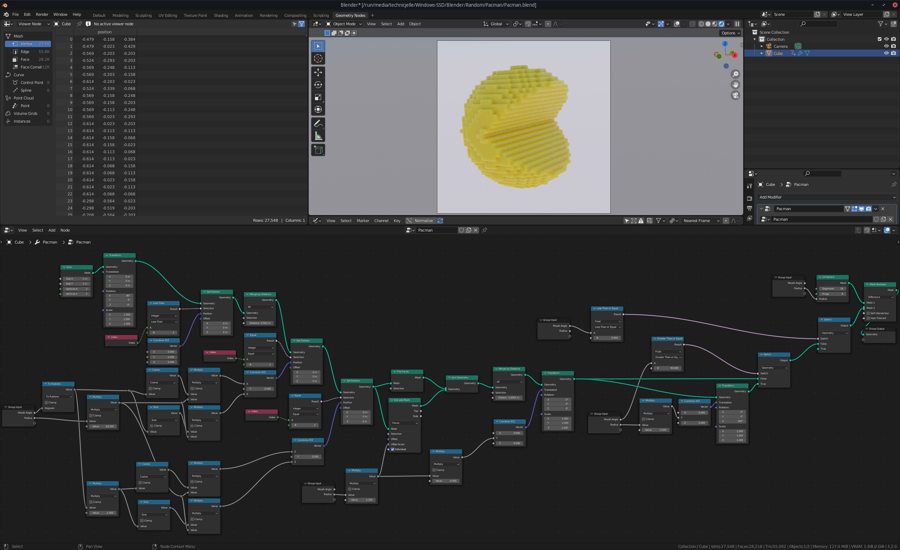

# Pacman

I made a Pacman!

Blender YouTuber Default Cube uploaded [a video tutorial](https://www.youtube.com/watch?v=AM_HYYY6VII) on how to make a Pacman with Blender Geometry Nodes.

Before watching how he did it, I tried my own hand at doing it and this is the result!

It took me two attempts and about two hours of fiddling until I got it looking nice,
but I am very happy with the outcome :)

<video src="pacman_0001-0060.mp4" autoplay muted loop playsinline></video>

Here is the final node-tree:

I posted it on ArtStation, too, so give me a like and a follow over there if you want: https://www.artstation.com/artwork/KO9Y1o
