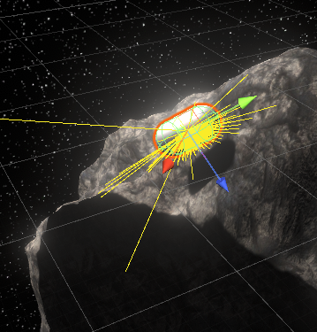
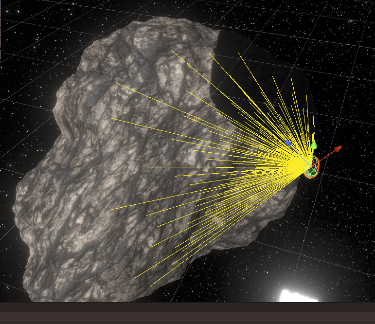
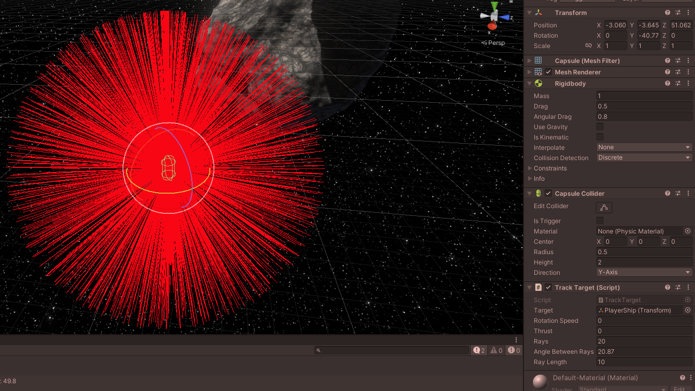

# Enemy AI in my Space Shooter Game

<iframe src="https://www.youtube-nocookie.com/embed/61txGXSI4q8" title="YouTube video player" allow="fullscreen; autoplay; clipboard-write; encrypted-media; picture-in-picture; web-share" referrerpolicy="strict-origin-when-cross-origin" sandbox="allow-scripts allow-same-origin"></iframe>

Today, I felt motivated to make the movement AI for the enemies in my in-development Space Shooter game in Unity.

The last few days, I had already been thinking about how to best approach this,
and ultimately I had thought up a system that would use a cone of raycasts as the "eyes" of the enemies.
Those would detect the asteroids in front of them and by comparing the results from all the raycasts,
it would choose the best direction for it to go.

(Raycasts are basically a ray that you can shoot from one point to another point.
That ray can collide with something on its way, and then it can give back information about the position of the hit,
the thing it hit etc.)

At first, I just had the enemy (at that point still just a capsule)
simply gradually turn towards the player and accelerate forwards

<video src="Video1.mp4" controls autoplay muted loop playsinline></video>

Just simply this was already surprisingly effective at annoying the player, but my goal was something more than this.
For one thing, this could very easily get stuck behind asteroids.

So I started working on the raycast system! The enemy would shoot out a ray directly in front of where it's going
and checks if it detected a game object that can't be bumped around, like an asteroid.
(The Unity RigidBody property "kinematic".)
So, if the enemy detected an asteroid in front of it, it would shoot out a cone of rays.





You can see those rays being shot out from the capsule in these images. It's really scanning that asteroid!

The problem with the system I have displayed here is that I hadn't actually thought out
how exactly I wanted to make the AI choose which way to go.
I had thus far only thought about the raycasting, but not the actual "thought" behind the choosing of the new direction.

I tried a few different systems, but ultimately had to switch gears a bit,
because this system still shot out one ray usually and if it hit an asteroid, it would shoot out more.
This system proved to not be effective enough, so I had to make it so that it always shot out the whole cone.

<video src="Video2.mp4" controls autoplay muted loop playsinline></video>

As you can see here in this video, the rays all seem to get shot out fine.
Except they don't.
Which gets more apparent if the amount of rays it shoots out gets turned up:

<video src="Video3.mp4" controls autoplay muted loop playsinline></video>

This had to do with the way I calculated the direction in which to shoot the rays, which at first was this:

```cs
for (int x = -rays; x <= rays; x++)
{
	for (int y = -rays; y <= rays; y++)
	{
		Vector3 rayDir = Quaternion.Euler(x * angleBetweenRays, y * angleBetweenRays, 0) * dir;
		Debug.DrawRay(_position, rayDir * rayLength, Color.red);
	}
}
```

And it turned out it had to be this, instead:

```cs
for (int x = -rays; x <= rays; x++)
{
	for (int y = -rays; y <= rays; y++)
	{
		Vector3 rayDir = Quaternion.AngleAxis(x * angleBetweenRays, _transformCached.TransformDirection(Vector3.up))
		               * Quaternion.AngleAxis(y * angleBetweenRays, _transformCached.TransformDirection(Vector3.right)) * dir;
		Debug.DrawRay(_position, rayDir * rayLength, Color.red);
	}
}
```

I'm not too familiar with how quaternions work exactly yet,
but I think it had to do with the rays not taking the rotation on the enemy transform into account correctly.
By explicitly doing TransformDirection for each axis, that solved it.

In this video, you can see it finally working correctly!

<video src="Video4.mp4" controls autoplay muted loop playsinline></video>

So with this better system for continuous raycasting, I could continue working on the actual choice of direction!

I tried quite another few different comparison methods, but this is what I ended up going with:
The enemy shoots out all the rays first, and if it hits anything,
it chooses the direction of the ray that's the furthest point from anything it hit.
As such, it can pretty nicely avoid asteroids!

You can see the final result in the YouTube video all the way
at the [top](#enemy-ai-in-my-space-shooter-game) of this post!

**You can download this version of the game
[here](https://github.com/TechnicJelle/SpaceCombat3DX/releases/tag/v0.0.2)**  
_(builds available for both Windows and Linux)_

And you can see the source code of this version [here](https://github.com/TechnicJelle/SpaceCombat3DX/tree/v0.0.2).

---

By the way, this is what happens if you turn up the amount of rays and the distance between them too much:


