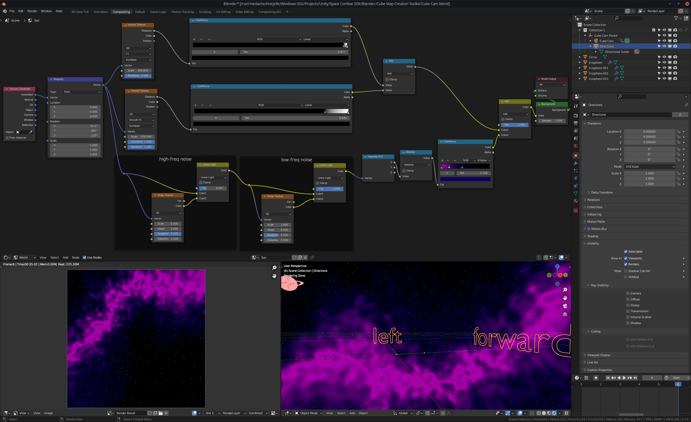
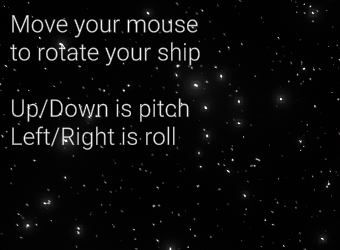
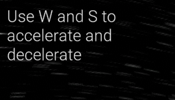
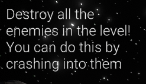
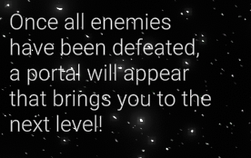

# Space Combat 3DX Updates

<iframe src="https://youtube-nocookie.com/embed/aCmfekB2mho" title="YouTube video player" allow="fullscreen; autoplay; clipboard-write; encrypted-media; picture-in-picture; web-share" referrerpolicy="strict-origin-when-cross-origin" sandbox="allow-scripts allow-same-origin"></iframe>

Since the last post, I've been hard at work adding more and more features! Mainly the second level and sounds,
but there's a lot more that went into it all!

## Enemy health

Enemies now have health and can be defeated by bumping into them.
I'll add an actual shooting mechanic to both the player and the enemies later.
For now, this slightly more crude solution will have to do.
The enemies also now have thruster particles of their own, just like the player.

## Skybox

I have added a second level with another completely custom skybox made in Blender!
Those top two voronoi textures with the very wide colour ramps together are actually the first level's skybox.
It just generates a ton of tiny white dots.
There are two layers, because one makes tiny dots and the other makes even more and smaller dots.

The bottom part is two layers of noise, distorting the UV space to generate a warped line going around the skybox.
That line is then coloured in by the last colour ramp.

This cube map has been rendered out using the excellent [Cube Map Creation Toolkit](https://blendswap.com/blend/17087).

## Portals

You can go from one level to the other by travelling through a portal that appears once you've defeated all the enemies!

.png)

## Sound

I also added sounds to the player's engine and also the enemies make buzzing sounds.

And the game has some nice background music to fill up the empty space!

Credits are listed in the repository's [README](https://github.com/TechnicJelle/SpaceCombat3DX/tree/main#assets-used).

## Menu

There's now a pause menu with volume sliders for three different categories of sounds!
There is now also a quit button there.
That is useful, because before there was no other way to stop the game than to press Alt+F4!

.png)

## Tutorial

There's now also a bit of a tutorial in the top left that explains what to do:

This tutorial system will be improved later.

---

I'll be putting this project on hold for a little bit while I work on other projects.
Perhaps I'll write about those too! :D

**Download the game [here](https://github.com/TechnicJelle/SpaceCombat3DX#readme)!**
