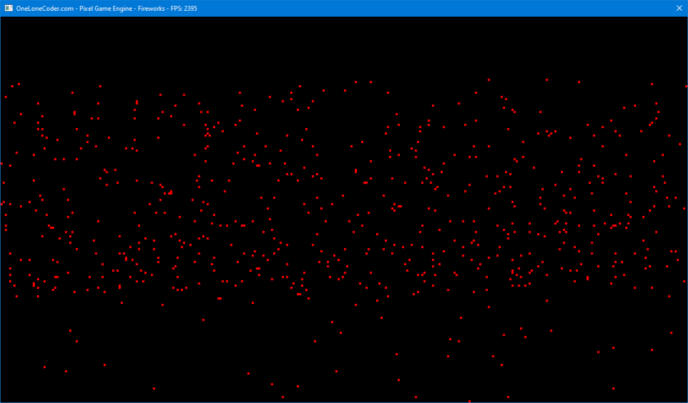

# Fireworks Display in C++ with the PixelGameEngine

Over the last couple of days, I've made a simple, little fireworks display:

<video src="fireworks.mp4" autoplay muted loop playsinline></video>

It was supposed to be a quick project, but the physics were a little different than I usually do,
so it took a little longer.

In the past, I've always made my simulations like these in [Processing](https://processing.org/),
which is a very, very great tool for learning stuff like this.

Though now I feel like I'm ready for something more advanced,
so I'm starting to use the PixelGameEngine for stuff like this,
which is a something similar to Processing, but you use C++, instead.

C++ is a programming language just like Processing is, but it's a lot more difficult.
The performance advantages of it, however, often outweigh the extra complexity.

So switching to C++ allows me much greater **performance**
and also much more **control** about what exactly happens everywhere.

In Processing, the simulations typically run at a set frame rate, 60 fps by default.

In the PixelGameEngine, the frame rate is unlocked, meaning that it'll go as fast as possible.

Movement on computers usually goes by displacing a thing by a little bit every amount of time.
When that amount of time is constant, like in Processing, this is easy:
if we want to move a circle 60 pixels a second, we simply have to move it by 1 pixel per frame.

In the PixelGameEngine this would not work, as the frame rate is not constant: sometimes it's 1000 fps,
and at other times it is 3000 fps! (Told you the performance was better ;D )

If we were to move the circle by one pixel every frame, the circle would sometimes move faster than at other times,
which is not what we want.

As such, a different way of movement has to be used, and luckily for us,
the PixelGameEngine provides the perfect solution for this: _delta time_!

Delta time is the amount of time that has passed since the last frame was displayed,
and we can use this to multiply the speed of the circle with to make the speed constant!

To move something in a way like one would move something in real life, we need a _physics system_.
This is used, so we can apply forces to objects to move them,
instead of just saying "the circle moves at 100 pixels per second".

Writing a physics system that takes the delta time into account correctly was surprisingly
more difficult than I had anticipated at the start of this project.

I started by implementing a physics system like I was always used to from Processing,
learnt from the book The nature of Code, while now trying to always account for the delta time in my calculations:  
_(`fElapsedTime` is the delta time)_

```cpp
void Particle::Update(float fElapsedTime)
{
	velocity += acceleration;
	position += velocity * fElapsedTime;
	acceleration = { 0.0f, 0.0f };
```

But in the end, I had to give up on that and go for a different way of calculating the delta time into my code...

I was helpfully given a link to
[this blog](https://code.tutsplus.com/how-to-create-a-custom-2d-physics-engine-the-core-engine--gamedev-7493t#timestepping)
that explains a new (to me) way of handling cases like exactly these!

```cpp
const float fps = 100
const float dt = 1 / fps
float accumulator = 0

// In units of seconds 
float frameStart = GetCurrentTime( )

// main loop 
while(true)
	const float currentTime = GetCurrentTime( )

	// Store the time elapsed since the last frame began 
	accumulator += currentTime - frameStart( )

	// Record the starting of this frame 
	frameStart = currentTime

	while(accumulator > dt)
		UpdatePhysics( dt )
		accumulator -= dt

	RenderGame( )
```

This method, simply put, keeps track of the delta time over a longer amount of time, and if a certain amount of time has
passed, let's say a tenth of a second, a new physics calculation is done.

This effectively decouples the rendering and the physics from each other, allowing the physics to run at its own pace,
while letting the rendering go at its own breakneck speed.

What that also gives me, is a way to choose how often I want to calculate the next physics step, resulting in a simple
way to set how accurate I want the simulation to be!

So I followed the tips from that blog post and implemented them into my simulation and after a bit of work, it all looks
as great as it does now :)

So that's it!

**You can find the source code for this project [here](https://github.com/TechnicJelle/FireworksPGE)**

---


