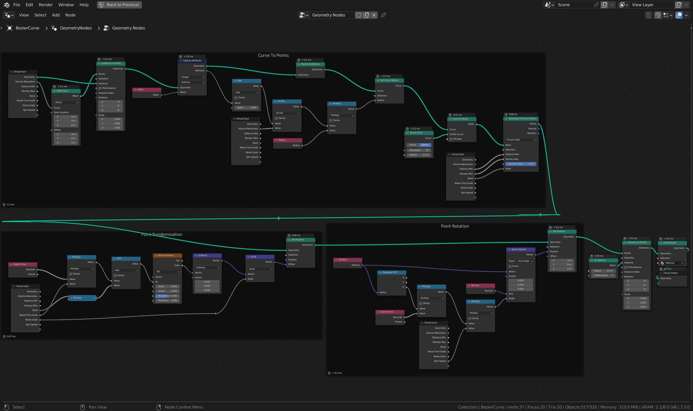
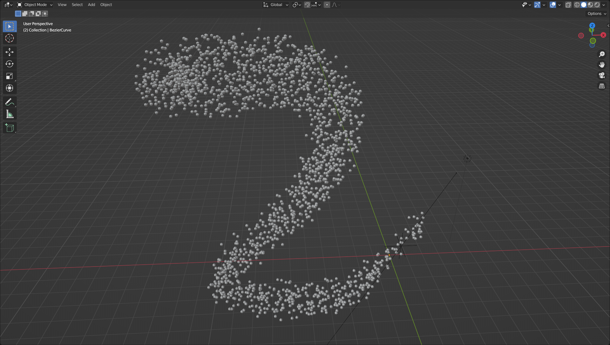
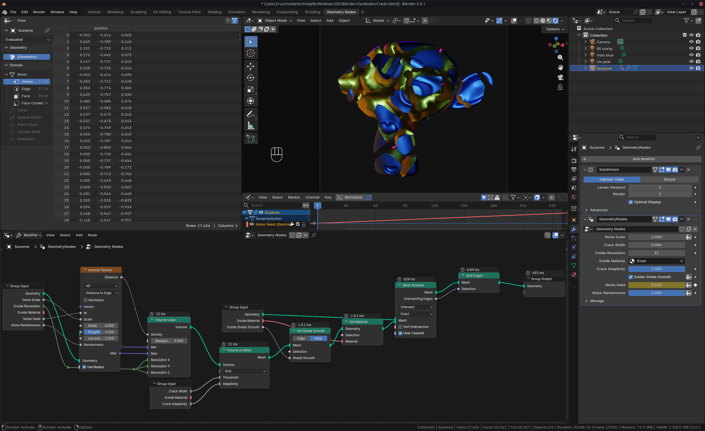
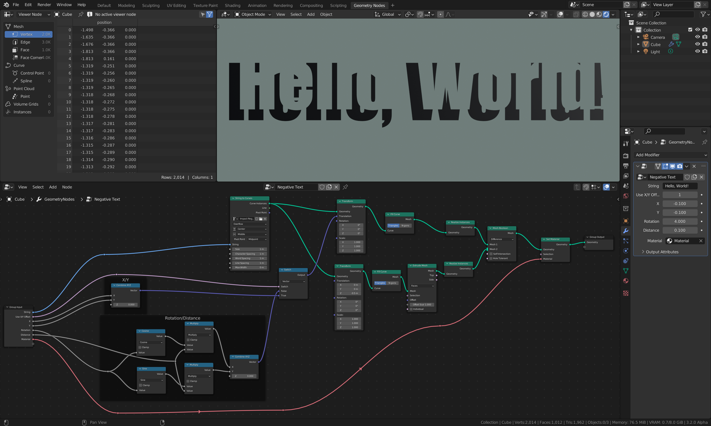

# Some GeoNodes art I made in October

## Whizzy Points Along Curve

<video src="Whizzy0001-0300.mp4" autoplay muted loop playsinline></video>

I made some particles that spin around in a fun way! :D

The main node network:

There is currently no way to spawn points randomly inside a volume, so I made a custom way to do that.

With the GeoNodes setup, you can easily add more points on the curve and change the radius of the curve.

I posted this on ArtStation, too, so give me a like and a follow over there if you want:
https://artstation.com/artwork/eJn9ew

## Cracks

Originally, this was a post solely about the Whizzy Points setup, but while porting the post to my new blog site,
I found another two pieces I made in the same timeframe, so I thought I might as well share it here! :)

<video src="Cracks0001-0250.mp4" autoplay muted loop playsinline></video>

## Negative Text

This one was made before October, but 🤫

