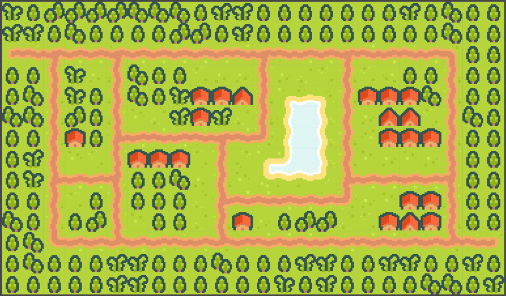
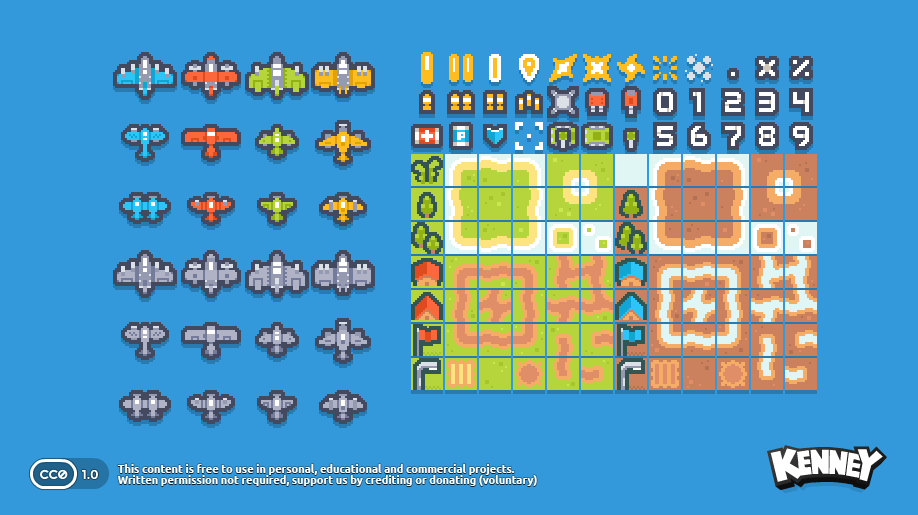
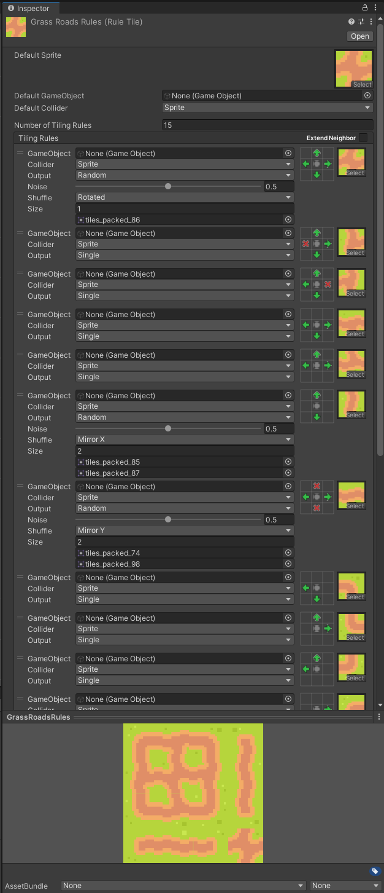

# Planes Tower Defence - Level

Over the last couple of weeks, I've been working on making a little tower defence game in Unity.
Now that I've made quite some progress with the base of the game,
I felt like it was time to write a bit about it, so let's go!

In this post, I'll write about the creation of this level:

## Tiles

I started off with finding a good tileset to use.
For this game, I wanted to focus on the code and behaviours, instead of on the art.
So I found [this nice Kenney pack](https://kenney.nl/assets/pixel-shmup):

So then I got to work importing this into Unity, to make a nice level with these tiles.
This is the first time I'm making a 2D game in Unity, so I had to look up how to make tile grids work and found
[this great tutorial](https://youtube.com/watch?v=g83_gwEO0kM).

I made good use of the auto-tiling feature that Unity provides,
so I could just simply draw where I wanted the roads to be,
and Unity would then choose exactly which tile of the tileset to put where,
so the roads would look nice and connected.

## Artifacting

During the process of working with this grid of tiles, I found a strange problem, though.
Sometimes there would be small lines where they shouldn't be, as you can see here:

There's just the tiniest line of darker pixels in the green grass.
This had me, and my teacher, quite stumped for a while,
until we finally figured out that it was due to the specific dimensions of the viewport!
It wasn't an even amount of pixels wide by high, so at some rows and columns,
the GPU chose wrong which pixels to sample from the tileset texture.
So luckily this issue could be solved very easily by just never having a screen with an uneven numbered resolution,
which never happens anyway! It just can happen inside the Unity editor.

Next post will be about the "pathfinding" I did.
(And you'll also understand then why I'm writing that with quotes ;) )

**Source code available [here](https://github.com/TechnicJelle/PlanesTowerDefence)**
