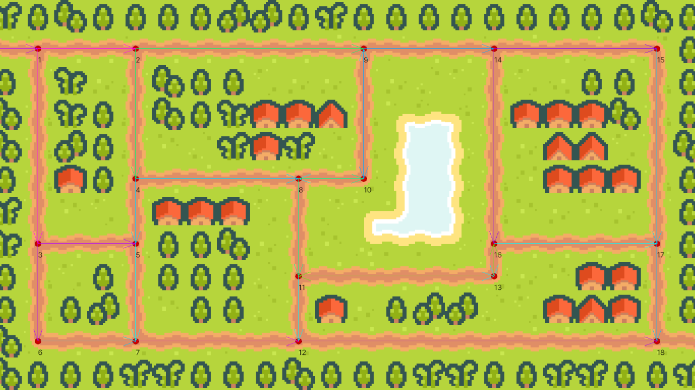
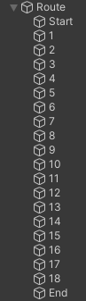

# Planes Tower Defence - "Pathfinding"



In the last post, I wrote about the creation of the level, so now in this one,
I'll be writing about how I prepared for the "pathfinding" for the enemies.

On each corner and split in the road, I placed an Empty game object.
This is an object that has no information about anything, except for its own position,
so they're a very nice base to work off of.

I placed all the Empty route points in a group called "Route" and named them:



Then I wrote a script for the Route, that draws a little sphere and a label for the name around each node,
but only when I'm editing the level; when the game is exported, it doesn't do anything.

```cs
[ExecuteInEditMode]
public class RouteNodeDrawer : MonoBehaviour
{
#if UNITY_EDITOR
	[SerializeField] private float nodeSize = 0.1f;
	[SerializeField] private int fontSize = 20;

	private IEnumerable<Transform> _points;

	private IEnumerable<Transform> GetRoutePoints() => GetComponentsInChildren<Transform>().Where(t => t != transform);

	private void Awake()
	{
		_points = GetRoutePoints();
	}

	private void Update()
	{
		if (EditorApplication.isPlaying) return;
		_points = GetRoutePoints();
	}

	private void OnDrawGizmos()
	{
		if (_points == null) return;
		foreach (Transform point in _points)
		{
			if (point == null) continue;
			Gizmos.color = Color.red;
			Vector3 position = point.position;
			Gizmos.DrawSphere(position, nodeSize);
			Handles.Label(position, point.name, new GUIStyle{fontSize = fontSize});
		}
	}
#endif
}
```

To have a nice base to pathfind on, we need what is called a Node Tree, which is simply a network of linked nodes.
So I had to link each node to the next one. There aren't too many nodes here, so I could totally have done this by hand.
That wouldn't be any fun, though, so I wrote another script that automatically links nodes together!

```cs
public class RouteNodeSetup : MonoBehaviour
{
	private static bool IsAboutEqual(float a, float b) => Mathf.Abs(a - b) < 0.01f;

	private void Awake()
	{
		RouteNode[] nodes = GetComponentsInChildren<RouteNode>().ToArray();

		foreach (RouteNode node in nodes)
		{
			if (node.nextNodes.Count != 0) continue; //don't overwrite manually set connections

			List<RouteNode> rightNodes = new();
			List<RouteNode> bottomNodes = new();

			foreach (RouteNode otherNode in nodes)
			{
				if (node == otherNode) continue; //don't connect to self

				//if otherPoint is to the right of this point
				if (IsAboutEqual(node.transform.position.y, otherNode.transform.position.y) && otherNode.transform.position.x > node.transform.position.x)
				{
					rightNodes.Add(otherNode);
				}
				//if otherPoint is to the bottom of this point
				else if (IsAboutEqual(node.transform.position.x, otherNode.transform.position.x) && node.transform.position.y > otherNode.transform.position.y)
				{
					bottomNodes.Add(otherNode);
				}
			}

			//sort by x position
			rightNodes.Sort((a, b) => a.transform.position.x.CompareTo(b.transform.position.x));
			//sort by y position
			bottomNodes.Sort((a, b) => b.transform.position.y.CompareTo(a.transform.position.y));

			if (rightNodes.Count > 0) node.nextNodes.Add(rightNodes[0]);
			if (bottomNodes.Count > 0) node.nextNodes.Add(bottomNodes[0]);
		}
	}
}
```

This script loops through all the Empties, and makes them check all other Empties.
If there's an Empty to the right or to the bottom of this, we link that one as being a possible next node in the tree.

Due to the way I laid out this level, there are a couple nodes in this network that either have dead ends (10 and 13),
or neighbours that shouldn't actually be connected (5 and 16).
So those nodes, I set up manually, but the other ones all connect themselves automatically!

The Route Nodes then draw little debug arrows, so we can easily see which nodes point to which other nodes.

Node trees usually don't have directional links, like I have here (as you can see by the arrows).
Instead of having directional links, they just throw all nodes into one big, fully interconnected tree,
and use a proper pathfinding algorithm like A* ("a star") to calculate the best route to get from one point to another.
A* is used in many, many games, due to its versatility and relatively accurate and speedy performance.
I've programmed A* before, but I didn't feel like doing it again
<span class="small">(because it's kind of annoying)</span> so I went for something simpler for this game.

The enemies in this game don't plan a route beforehand, but instead chooses where to go on the fly:
When an enemy arrives at a Route Node, it can see which other Route Nodes this current one connects to,
and then just choose one of those as its next destination.
As long as all the nodes are connected properly (which you can check by following the arrows),
this is a fine enough method in this case.

The reason this works here, is precisely because my nodes aren't fully interconnected, but have a direction to them.
If they weren't directional, the possibility for enemies to get stuck walking in circles would arise
(which you can, in fact, sometimes see happening around nodes 10 and 13,
where there are arrows one way and the other over the same road)

The way enemies choose their next destination is by looking how often each potential next destination has been visited,
and it'll choose the one with the least amount. This means the enemies in this game all choose the least trodden path.
I found this a quite elegant solution and in fact I prefer it over just randomly choosing a next destination,
as this is surer to evenly distribute enemies over each different route.

So this is the reason why I wrote pathfinding with quotes;
it doesn't actually find a path it wants to go along at the start with a proper pathfinding algorithm,
but it just chooses between some predefined path segments.

The next post will talk more about the enemies themselves.

**Source code available [here](https://github.com/TechnicJelle/PlanesTowerDefence)**

---

As a bonus, here's a video I recorded during this process, when the node linking didn't work all too well yet...

<video src="Peek 2022-12-23 11-09.mp4" controls loop muted playsinline></video>
