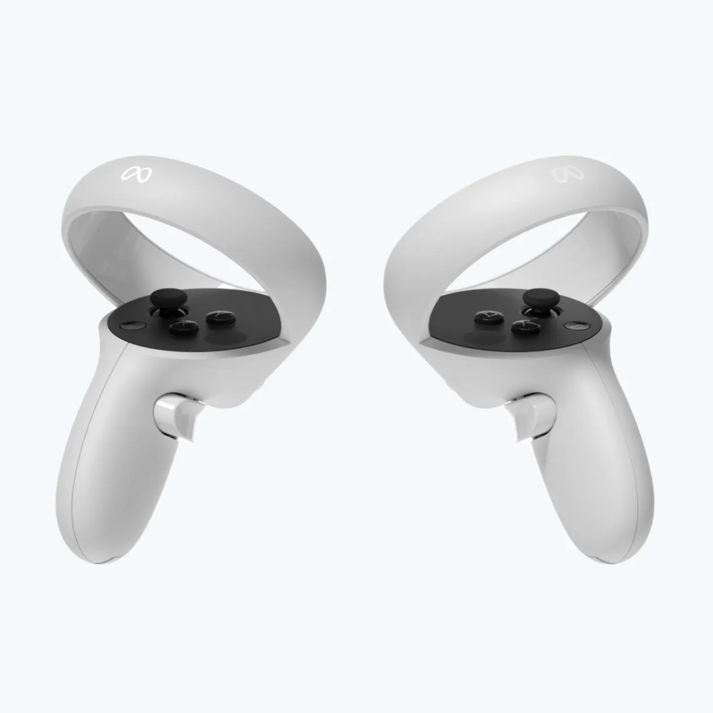

# Controller-less VR teleportation

For my study, I am currently working with a team of other students on a VR experience for a local museum.

The museum plans to have a VR headset somewhere, which visitors can put on to experience how life was like in the past.

There are lots of things to show, so the user needs some way to move from one place to another.

Sometimes, this is done with a Controller, where the user can move the joystick,
which moves the camera around the virtual world.

This has a big problem, however: such smooth movement in VR is incredibly nauseating
for people who are not accustomed to it, which is definitely most museum visitors.

As such, game designers in the past invented the now common mechanic of **teleportation**.
You point the controller somewhere, click a button, and you get teleported to where you were pointing.  
The range is usually not very large, to keep it balanced.  
I have also seen a slightly different mechanic in some VR games,
where there isn't a _button_ to teleport, but it is the _joystick_.
You point the joystick somewhere, and you can choose which direction you want to end up in after the teleport.

The concern is that this can be a bit tricky to learn how to do.

Especially **if we decide to not use any controllers**. To keep things simpler, we would like to not need controllers.
Putting on the headset is already complicated enough, and we need to keep this experience as accessible as possible.  
Controllers can also get stolen or damaged.

Luckily, there are ways to do this teleportation with hand gestures only!

However, these gestures are even more complicated than the controller buttons for it.

So we racked our brains over a really nice way to handle moving around the environment.

Finally, I had an idea!

We can designate specific _Points Of Interest_ in the environment, which will be the only places the user can be at.  
Then to move from one POI to the other, the user can just look over to such a POI, and they will teleport to it.

Of course, that teleportation should not be instant, otherwise that will still be confusing and disorienting.

So if the user looks at a POI, a small animation will play in front of them to show that something will happen
shortly.  
(If they look away again, the countdown and whole teleportation process will be cancelled, naturally.
They really need to stare at the POI for a solid few seconds, to make sure they really want to do it.)

After that animation finishes playing, the screen will fade to black and back. During the darkness,
the user will have been teleported.  
The teleportation is not instant, again, to prevent disorienting the user.

I mocked up a small visual example of how this system could look like in Blender, and showed it to my team.  
They unanimously agreed with the system! 🥳

Here is that animation:

<video src="MovementConcept0001-0250.mp4" controls loop muted playsinline></video>

You will see that the Points Of Interest are marked with blue holograms,
which become taller if the user looks near them.

We are not entirely sure if this part will remain this way,
as the museum really wants the experience to be as purely realistic as possible.
