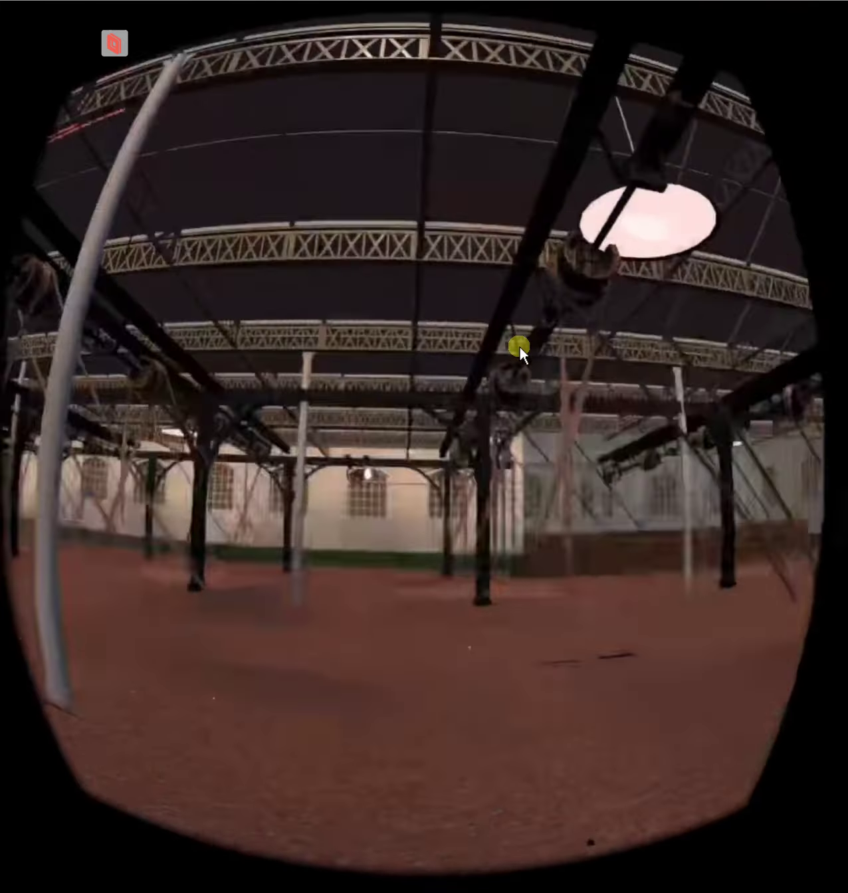
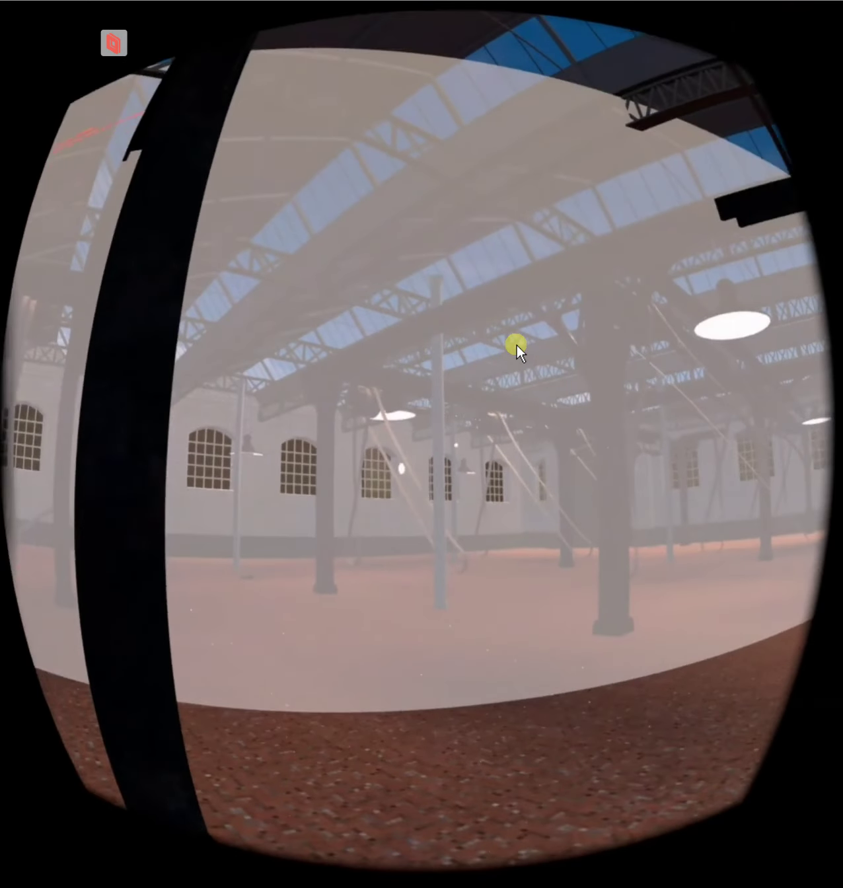

# A few screenshots from the Weaving Factory project

These are a few excerpts from a recording of the first time I managed to get the experience
running on the standalone VR headset.

_(This was captured by [scrcpy](https://github.com/Genymobile/scrcpy)'ing
from the headset to the remote development machine.
From there, the screen was cast to my own laptop through [Parsec](https://parsec.app/),
where it was finally recorded with [Peek](https://github.com/phw/peek).
Still one of the wildest tech-stacks I've ever used, haha)_
