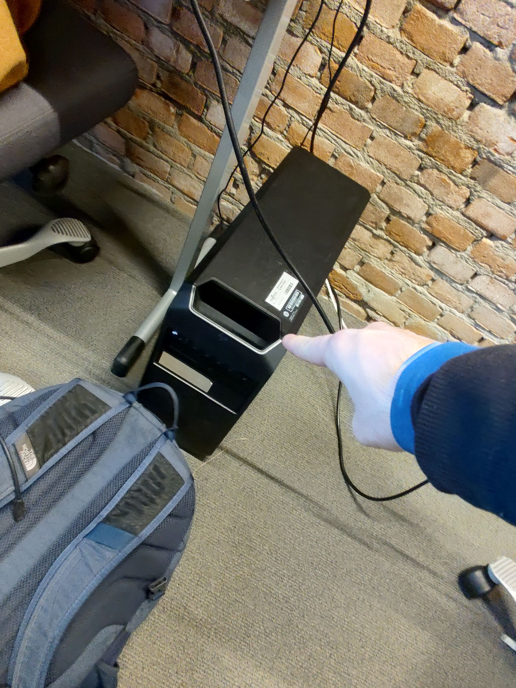
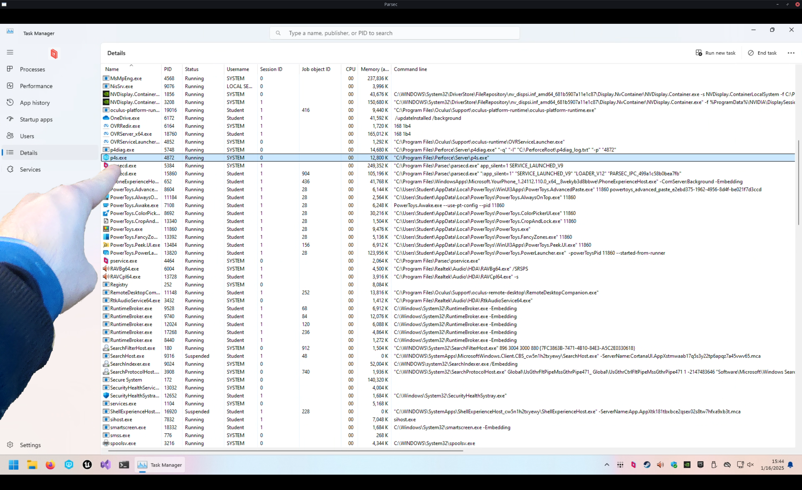

# Infrastructure for Teamwork, a.k.a. Version Control

Working together on a game is quite difficult.  
How do you make sure everyone is on the same page?

You could send zips with assets and code between people, but that is slow, cumbersome, and _very_ error-prone.

This is why Source Control software was invented.  
With Source Control, you can store the project files on a server,
and everyone who wants to work on the project files, can download the project from the server.  
Once they're done with their changes, they send them back to the server.  
Then the other people can get those changes from the server again.

There are many different Source Control softwares. Probably the best-known one is git.  
(Source Control, Version Control, Revision Control all mean essentially the same thing.)

Git is very good for working on projects that are all just plain-text code.  
However, it kind of falls flat when it needs to deal with binary assets, like textures, models, and sounds.  
There are solutions to this, like git-lfs and git-annex, but those are still not very nice to use.  
git-lfs is quite expensive if you use GitHub, and it's not very simple to self-host either.  
git-annex is much easier to self-host, but it's not as well-supported as git-lfs.

In Unreal Engine, Scenes and Blueprints are also binary files.  
So if you don't use C++ but only Blueprints, basically your entire project is binary files.

This is why I went looking for a different Version Control Software that can handle this better.  
At my internship, I used Subversion, which is said to work better with binary assets,
but in my experience then, it still wasn't exactly great.  
Though that might also have been due to the fact that they barely used any of its fancier features there.

Unreal Engine itself recommends using Perforce Helix Core.  
(Perforce is the company, Helix Core is the VCS, but the term "Perforce" is usually used to refer to the VCS itself,
due to historical reasons. [Source](https://www.youtube.com/watch?v=jIQEjDiSe0g))  
So I looked into it, and indeed, it seemed very suitable!

We requested a computer from the XR Lab to use as server for this project,
and I installed the Helix Core Server on it.

It was surprisingly easy to install!

I then downloaded the Helix Core Client application on my laptop, and connected to the server.  
The setup there took a while, because there was a lot to learn.  
But in the end, I did it!

Sadly, Perforce is not free, so we are forced to use the free version, which is limited to a maximum of five users.  
We are with ten people, so we had to choose a few "representatives"
who would actually put the things everyone made into the project.

We requested an educational licence from Saxion, but got told to wait.
Now that the project is over, we still don't have it...  
We also requested an educational licence from Perforce itself, directly, but we have still not got a response either.  
But we made do with the limitations we got.

I wrote
[a guide](https://github.com/TechnicJelle/UE5_GHActions_VRTemplate/blob/main/docs/Perforce%20Setup%20Guide%20for%20Users/README.md)
for my teammates on how to set up a workspace for the project with Perforce,
and improved it multiple times based on user testing and feedback.  
(I sat next to my teammates while they were following the guide and tried my best to not say anything;
to let the guide speak for itself.
I would then take note of what went wrong and improved that section of the guide for the next user test.)

Over the months of this project, we all used P4V and Perforce to work together on the project.  
Due to Perforce's locking system, we never had any merge conflicts!  
Most of the team actually really enjoyed working with Perforce.  
Personally, I do miss git, but I acknowledge that for an Unreal Engine project, Perforce is a lot better.

And I also found it pretty nice to work with.  
The documentation was pretty good, and they have a lot of tutorials, guide, and demonstration videos,
which have been very helpful during the setup.  
It's very useful to be able to follow along every single click.
