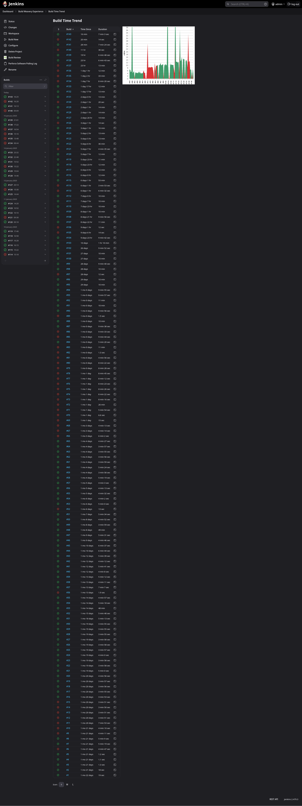
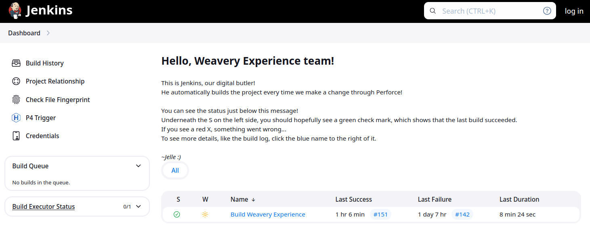
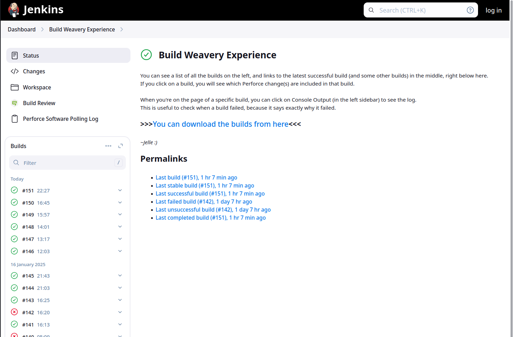
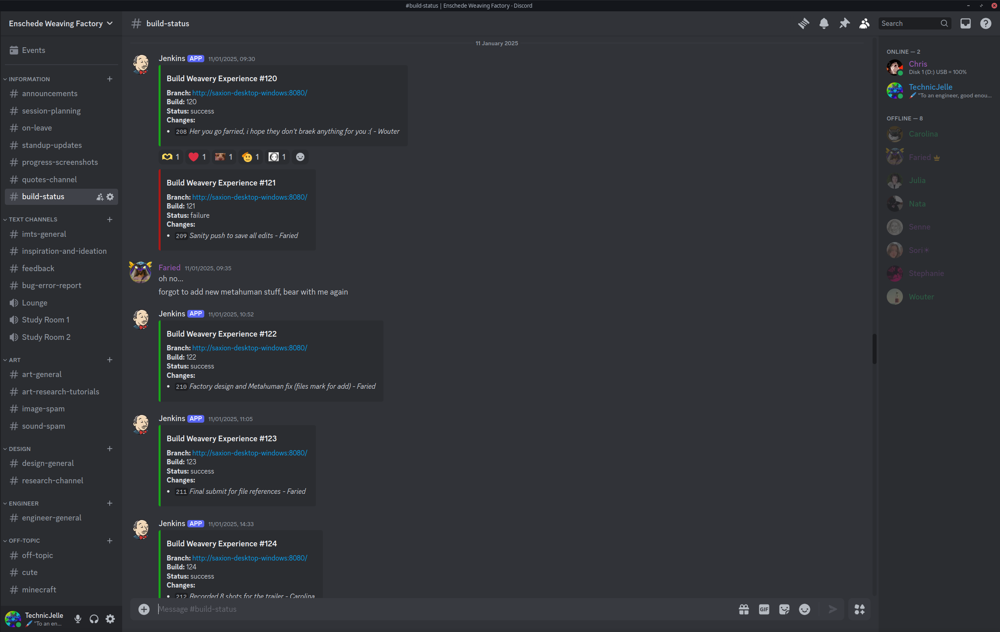
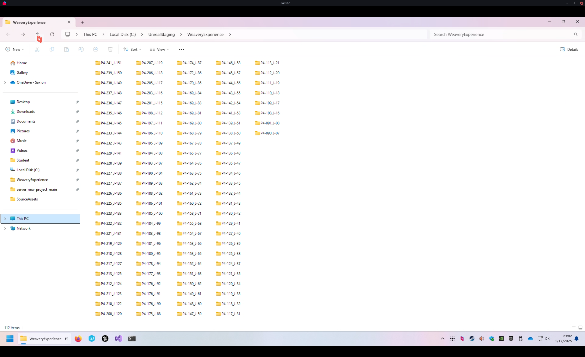
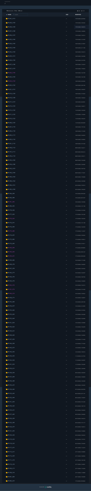
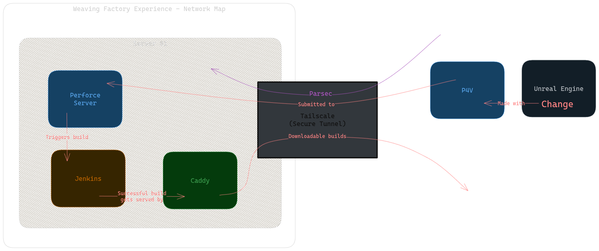

# Infrastructure for Disaster Control, a.k.a. Automatic Builds

We all know the feeling of pure and utter stress when, ten minutes before the deadline,
you finally click the "Build And Export" button in your game engine, and then it fails to build for some reason.

To prevent issues like this, people invented automated builds, also referred to as CI/CD
(which stands for Continuous Integration and Continuous Deployment).

This is a mechanism that tests the project every single time a change is made
(a git commit is pushed, or a Perforce changelist is submitted).  
Because of this, we very quickly know whenever a change broke the build, which means we can fix it immediately,
instead of having to fix it at the end.

It is also useful whenever a regression happens that doesn't break the build.  
We can go back to a previous build, and see if the issue is there or not.  
By checking a few builds by way of [binary search](https://help.winternode.com/General-Utilities/Linear-Binary-Search),
we can very quickly pinpoint the exact change that caused the regression.  
We have used this a few times, in fact.  
Once, the weaving machines stopped showing up in the build, and with this method,
we were able to pinpoint the exact change that caused it, and then we submitted a fix!

It's very useful to have an archive of builds for every change we made to the project.

There are multiple different softwares that do this kind of thing, but Jenkins is by and far the most used.
Both by indies, but also large AAA studios!  
So knowing how it works is very useful, so that's why I picked Jenkins for the job.  
Again, like with Perforce, it was pretty easy to install!

Here is a list of every build run that Jenkins did, including a neat little graph :)

Configuring it was quite tricky, though.  
I had to create a console terminal CLI command that makes Unreal Engine build project.  

Resources used:
([one](https://dev.epicgames.com/documentation/en-us/unreal-engine/unreal-automation-tool-overview-for-unreal-engine?application_version=5.4))
([two](https://github.com/botman99/ue4-unreal-automation-tool))

It took many days of constant iteration, but in the end, I got it to work very well!

I also wrote some explanations of what Jenkins is and how to use it on the Jenkins pages themselves,
for my teammates to read:

## Dashboard (The Home Page):

## Project Page:

## Notifications

Now, it is of course very useful to build the project and catch errors when they happen,
but if no-one looks on the Jenkins page, then no-one will see the status!  
Even if the website is accessible to everyone, people won't really look there very often.  
Which kind of makes the whole thing useless...  
So to solve that issue, I implemented Discord pings!  
There is [a Jenkins plugin](https://plugins.jenkins.io/discord-notifier/)
that automatically sends messages to a specific Discord channel once the build is done.  
This lets everyone know when the build succeeded or failed.

We of course already had a discord server that we used to discuss everything in, and to hold our online meetings with.  
So this `#build-status` channel fit in perfectly, and it was super helpful in catching and solving issues.

Whenever a build failed, people could click on the link,
and see the console output that Unreal Engine gave during the build,
so we could instantly see where the issue was coming from.  
And because it rebuilds for every change that is made,
we know for certain that the issue can only have come from the change that was just made!  
This meant that keeping every change small, made it easier to find and fix problems!

## Archive

Whenever a build succeeds, it gets stored on the server, in the build archive.

But storing it on the server alone is nice and all, but people can't really do anything with them there.  
I could personally access them by remotely connecting to the server,
but I cannot make my teammates go through all that.  
So I needed to make them more accessible for the whole team, to download whenever they please.

For this, I wanted to create a small website, from which they can download them.  
Just by going to the link, they could scroll through every build and download it immediately.

I already knew of multiple ways of easily doing this, so I tried out a few.

The Python programming language actually ships with a built-in webserver module
that can be used very easily with a single command.  
But Python wasn't installed, and installing Python on Windows is kind of annoying,
so I wanted something else. Something simpler.

I often use the program "darkhttpd" whenever I want a simple webserver, so I tried to download that,
but I couldn't get it to work on Windows. Seems like it only really supports Linux...

So I went looking for other, single-executable, webserver programs that _do_ support Windows.

And so I stumbled on "caddy".  
I'd actually heard of it before, but never used it, as I never had a need for it before then.
For actual full websites, I've always used nginx.  
After some time of looking at the official documentation of caddy's various configuration file formats
and command-line arguments, and tweaking things, I had it working like I wanted!  
It now even automatically starts when the computer boots up,
which is something that Perforce and Jenkins set up automatically.  

Resources used:
([one](https://caddyserver.com/))
([two](https://caddyserver.com/docs/quick-starts/static-files))
([three](https://caddyserver.com/docs/caddyfile/directives/file_server))
([four](https://caddyserver.com/docs/running#windows-service))

## Network map

Here's a summary of the setup, drawn as a network map:

## Future

There is a concept called [IAC, Infrastructure As Code](https://en.wikipedia.org/wiki/Infrastructure_as_code),
which I would like to look into, in the future.  
It seems very useful for these kinds of situations
where other people have to be able to take over and reproduce the setups.

## Inheritance

And I think that's it!
Unfortunately, likely none of this will roll over to the next team that has to work on this project,
because none of this is code that is inside our project folder.
I requested that they inherit the server computer, but I'm not confident that they will accept it.
